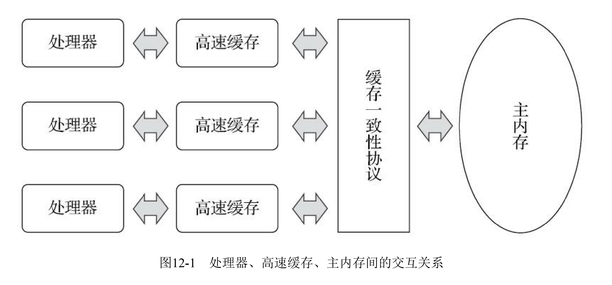
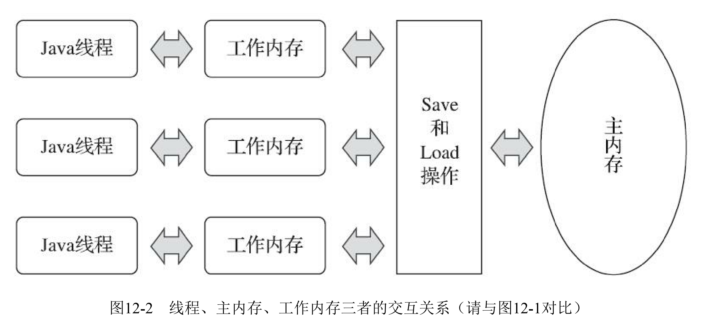
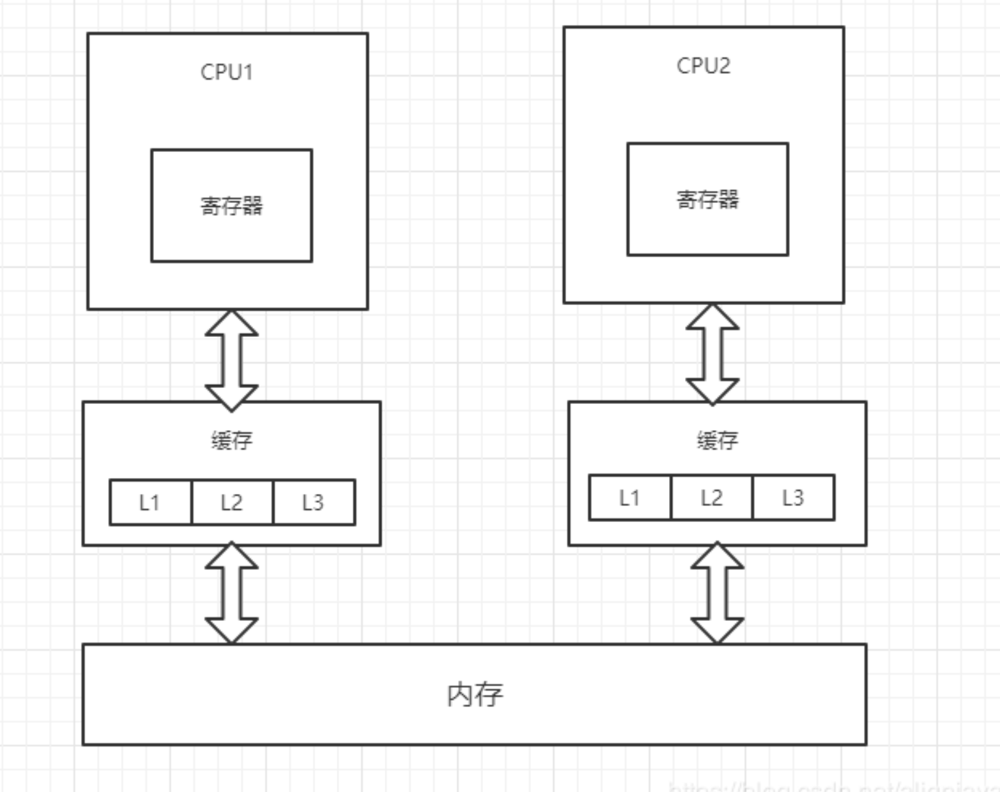
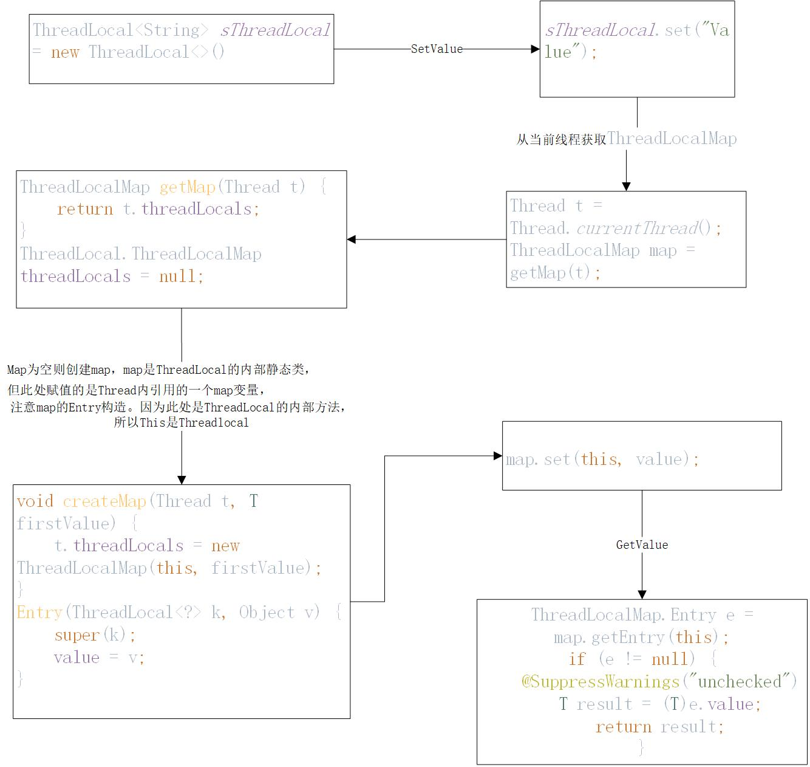
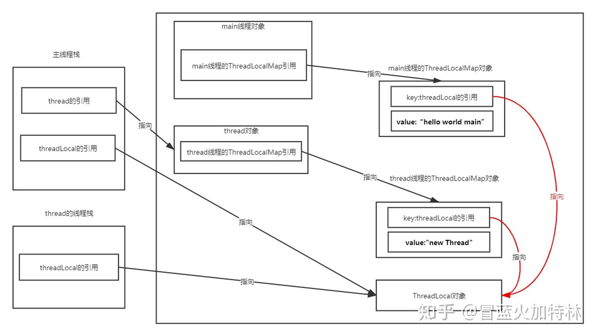
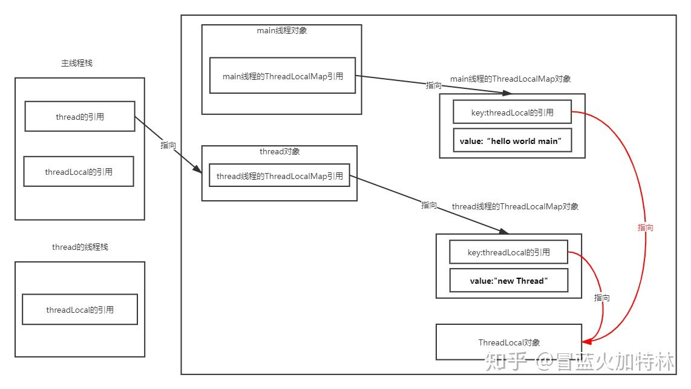
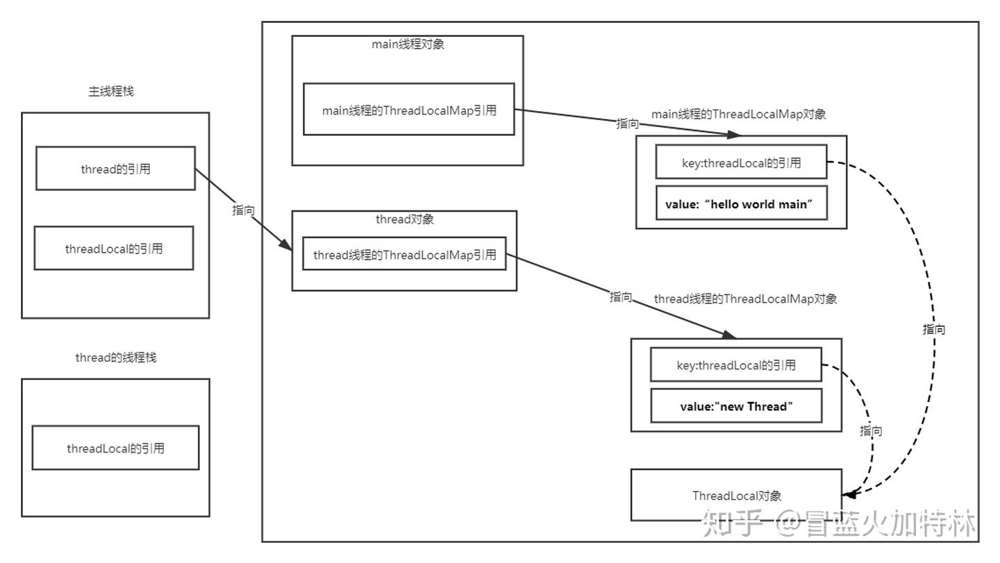

### 内存模型







### CAS

CAS指令需要有三个操作数，分别是内存位置（在Java中可以简单地理解为变量的内存地址，用V 表示）、旧的预期值（用A表示）和准备设置的新值（用B表示）。CAS指令执行时，当且仅当V符合 A时，处理器才会用B更新V的值，否则它就不执行更新。但是，不管是否更新了V的值，都会返回V的 旧值，上述的处理过程是一个原子操作，执行期间不会被其他线程中断。这种乐观并发策略的实现不再需要把线程阻塞挂起，因此这种同步操作被 称为非阻塞同步（Non-Blocking Synchronization），使用这种措施的代码也常被称为无锁（Lock-Free） 编程。

### volatile

#### 缓存一致性协议

https://www.cnblogs.com/ynyhl/p/12119690.html

#### 保证此变量对所有线程的可见性

​		这里的“可见性”是指当一条线程修改了这个变量的值，新值对于其他线程来说是可以立即得知 的。而普通变量并不能做到这一点，普通变量的值在线程间传递时均需要通过主内存来完成。比如， 线程A修改一个普通变量的值，然后向主内存进行回写，另外一条线程B在线程A回写完成了之后再对 主内存进行读取操作，新变量值才会对线程B可见。

#### 禁止指令重排序

```java
public class VolatileTest {

    private static volatile VolatileTest instance = null;
    //单例模式中应用volatile，确保指令不会重排序
    public VolatileTest getInstance() {
        if (instance == null) {
            synchronized(VolatileTest.class) {
                if (instance == null) {
                    instance = new VolatileTest();
                }
            }
        }
        return instance;
    }
}
```

instance = new VolatileTest();

该语句非原子操作，实际是三个步骤。

1.给singleton分配内存；
2.调用 Singleton 的构造函数来初始化成员变量；
3.将给singleton对象指向分配的内存空间（此时singleton才不为null）；
虚拟机的指令重排序–>

执行命令时虚拟机可能会对以上3个步骤交换位置 最后可能是132这种 分配内存并修改指针后未初始化 多线程获取时可能会出现问题。

当线程A进入同步方法执行singleton = new Singleton();代码时，恰好这三个步骤重排序后为1 3 2，

第一个线程初始化对象到一半，第二个线程来发现已经不是null了就直接返回了 实际上该对象此时还没有完全初始化 可能会出现这个问题。

那么步骤3执行后singleton已经不为null,但是未执行步骤2，singleton对象初始化不完全，此时线程B执行getInstance()方法，第一步判断时singleton不为null,则直接将未完全初始化的singleton对象返回了。

#### 实现原理

从三个层级讨论

1、字节码

> ACC_VOLATILE

2、jvm

在变量操作之前加上内存屏障，注意，jvm的内存屏障不同于处理器的内存屏障

> StoreStoreBarrier
>
> volatile 写操作
>
> StoreLoadBarrier

> LoadLoadBarrier
>
> volatile 读操作
>
> LoadStoreBarrier

3、处理器

> lock指令

#### volatile无法保证原子性？

```
/**
 * volatile变量自增运算测试
 *
 * @author zzm
 */
public class VolatileTest {
    public static volatile int race = 0;

    public static void increase() {
        race++;
    }

    private static final int THREADS_COUNT = 20;

    public static void main(String[] args) {
        Thread[] threads = new Thread[THREADS_COUNT];
        for (int i = 0; i < THREADS_COUNT; i++) {
            threads[i] = new Thread(new Runnable() {
                @Override
                public void run() {
                    for (int i = 0; i < 10000; i++) {
                        increase();
                    }
                }
            });
            threads[i].start();
        }
        // 等待所有累加线程都结束
        while (Thread.activeCount() > 1)
            Thread.yield();
        System.out.println(race);
    }
}
```

这段代码发起了20个线程，每个线程对race变量进行10000次自增操作，如果这段代码能够正确并 发的话，最后输出的结果应该是200000。读者运行完这段代码之后，并不会获得期望的结果，而且会 发现每次运行程序，输出的结果都不一样，都是一个小于200000的数字。这是为什么呢？ 问题就出在自增运算“race++”之中，我们用Javap反编译这段代码后会得到代码清单12-2所示，发 现只有一行代码的increase()方法在Class文件中是由4条字节码指令构成（return指令不是由race++产生 的，这条指令可以不计算），从字节码层面上已经很容易分析出并发失败的原因了：当getstatic指令把 race的值取到操作栈顶时，volatile关键字保证了race的值在此时是正确的，**但是在执行iconst_1、iadd这 些指令的时候，其他线程可能已经把race的值改变了，而操作栈顶的值就变成了过期的数据，所以 putstatic指令执行后就可能把较小的race值同步回主内存之中。**

```
public static void increase();
    Code:
        Stack=2, Locals=0, Args_size=0
        0: getstatic #13; //Field race:I
        3: iconst_1
        4: iadd
        5: putstatic #13; //Field race:I
        8: return
    LineNumberTable:
        line 14: 0
        line 15: 8
```

VolatileTest的字节码


### synchronized

synchronized 用的锁是存在 Java 对象头里的。如果对象是数组类型，则虚拟机用 3 个字宽（Word）存储对象头，如果对象是非数组类型，则用 2 字宽存储对象头。在 32 位虚拟机中，1 字宽等于 4 字节，即 32bit，如表 2-2 所示。


#### 实现原理

1、字节码

> monitor enter
>
> monitor exit

2、jvm

C++的锁实现

3、处理器

lock comxchg


### ThreadLocal

```java
public class ThreadLocalTest {
    //ThreadLocal可以只使用一个变量而在每一个线程保存一份线程独有的数据
    private static final ThreadLocal<String> sThreadLocal = new ThreadLocal<>();
    //可获取线程创建之前主线程数据的InheritableThreadLocal,但注意，一个ThreadLocal在每个线程都只能
    //保存一个值，因此如果子线程又调用了set，会覆盖主线程的值
    public static ThreadLocal<String> iThreadLocal = new InheritableThreadLocal<String>();

    private void showThreadLocal() {
        sThreadLocal.set("showThreadLocal: 这是在主线程中");
        System.out.println("线程名字：" + Thread.currentThread()
            .getName() + "---" + sThreadLocal.get());
        //线程a
        new Thread(new Runnable() {
            @Override
            public void run() {
                sThreadLocal.set("这是在线程a中");
                System.out.println("线程名字：" + Thread.currentThread()
                    .getName() + "---" + sThreadLocal.get());
            }
        }, "线程a").start();
    }

    private void showInheritableThreadLocal() {
        iThreadLocal.set("showInheritableThreadLocal: 这是在主线程中");
        System.out.println("线程名字：" + Thread.currentThread()
            .getName() + "---" + iThreadLocal.get());
        //线程b
        new Thread(new Runnable() {
            @Override
            public void run() {
                // iThreadLocal.set("这是在线程b中");
                System.out.println("线程名字：" + Thread.currentThread()
                    .getName() + "---" + iThreadLocal.get());
            }
        }, "线程b").start();
        //线程c，如果子线程重新设值，会替代主线程的值，因为存入map的key是同一个
        new Thread(() -> {
            iThreadLocal.set("这是在线程c中");
            System.out.println("线程名字：" + Thread.currentThread()
                .getName() + "---" + iThreadLocal.get());
        }, "线程c").start();
    }
    public static void main(String[] args) {
        ThreadLocalTest threadLocalTest = new ThreadLocalTest();
        threadLocalTest.showThreadLocal();
        threadLocalTest.showInheritableThreadLocal();

    }
}

线程名字：main---showThreadLocal: 这是在主线程中
线程名字：main---showInheritableThreadLocal: 这是在主线程中
线程名字：线程a---这是在线程a中
线程名字：线程b---showInheritableThreadLocal: 这是在主线程中
线程名字：线程c---这是在线程c中
```

#### ThreadLocal:



如main和线程演示，主线程中创建ThreadLocal，每个子线程（Thread）都有一个自己的ThreadLocal.ThreadLocalMap变量，map以主线程的ThreadLocal作为key保存一个数据，这样取值的时候都能通过主线程的ThreadLocal这一唯一的key取到自己线程独有的数据，主线程有多个ThreadLocal，就可以存取多个数据

#### InheritableThreadLocal

InheritableThreadLocal继承自ThreadLocal，如线程b所示，是可继承主线程数据的ThreadLocal。

```java
private Thread(ThreadGroup g, Runnable target, String name,
               long stackSize, AccessControlContext acc,
               boolean inheritThreadLocals) {
    ...
    
    Thread parent = currentThread();
    ....
    if (inheritThreadLocals && parent.inheritableThreadLocals != null)
        //复制主线程的数据到子线程
        this.inheritableThreadLocals =
            ThreadLocal.createInheritedMap(parent.inheritableThreadLocals);
	...

    /* Set thread ID */
    this.tid = nextThreadID();
}

inheritableThreadLocals是Thread一个变量
ThreadLocal.ThreadLocalMap inheritableThreadLocals = null;
```

在调用Thread构造方法时（new Thread是在主线程完成的），如果主线程inheritableThreadLocals不为空，则将主线程inheritableThreadLocals中的值复制给子线程。

```java
static ThreadLocalMap createInheritedMap(ThreadLocalMap parentMap) {
        return new ThreadLocalMap(parentMap);
    }
```

```java
//如果主线程的ThreadLocalMap有值，则复制到子线程的ThreadLocalMap
private ThreadLocalMap(ThreadLocalMap parentMap) {
    Entry[] parentTable = parentMap.table;
    int len = parentTable.length;
    setThreshold(len);
    table = new Entry[len];

    for (Entry e : parentTable) {
        if (e != null) {
            @SuppressWarnings("unchecked")
            ThreadLocal<Object> key = (ThreadLocal<Object>) e.get();
            if (key != null) {
                //可以继承InheritableThreadLocal，重写childValue根据需要获取数据
                Object value = key.childValue(e.value);
                Entry c = new Entry(key, value);
                int h = key.threadLocalHashCode & (len - 1);
                while (table[h] != null)
                    h = nextIndex(h, len);
                table[h] = c;
                size++;
            }
        }
    }
}
```

InheritableThreadLocal的存取复用ThreadLocal的方法


#### ThreadLocalMap的key为什么继承弱引用

```java
static class Entry extends WeakReference<ThreadLocal<?>> {
    /** The value associated with this ThreadLocal. */
    Object value;

    Entry(ThreadLocal<?> k, Object v) {
        super(k);
        value = v;
    }
}
```

如果一个对象**仅被**一个弱引用指向，那么当下一次GC到来时，这个对象一定会被垃圾回收器回收掉。

这里模拟一种场景，主线程新建Threadlocal对象，赋值“hello world main”，子线程也利用这个Threadlocal对象赋值“new thread”，此时内存引用情况如下：



假设两条红线是强引用，此时使得threadLocal = null;



​		虽然两个线程都主动释放掉了对ThreadLocal对象的引用，但是，从主线程thread引用->ThreadLocal对象，依然存在这一条可达路径。众所周知，现今主流JVM判断一个对象是否可回收的算法通常为可达路径算法，而不是引用[计数法](https://www.zhihu.com/search?q=计数法&search_source=Entity&hybrid_search_source=Entity&hybrid_search_extra={"sourceType"%3A"article"%2C"sourceId"%3A139214244})。可达路径算法以GCROOT出发，如果存在一条通向某个对象的强引用通路，那么这个对象是永远不会回收掉的(即便发生OOM也不会回收)。thread的引用是主线程的一个[本地变量](https://www.zhihu.com/search?q=本地变量&search_source=Entity&hybrid_search_source=Entity&hybrid_search_extra={"sourceType"%3A"article"%2C"sourceId"%3A139214244})，根据GCROOT算法，thread的引用是可以作为一个GCROOT的，那么现状就是：我们显式地释放掉了threadLocal的引用(threadLocal = null;)，因为我们确认后续我们不会使用到它了，但是，由于存在GCROOT的一条可达通路，程序并没有像我们希望的那样立刻释放掉ThreadLocal对象，直到我们所有的线程都释放掉了，即程序结束，ThreadLocal对象才会被真正的释放掉，这无疑就是内存泄露。为了解决这个问题，我们把图中的红线换成弱引用，如下图所示：




### 1

