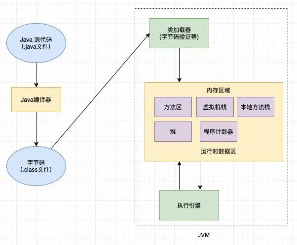
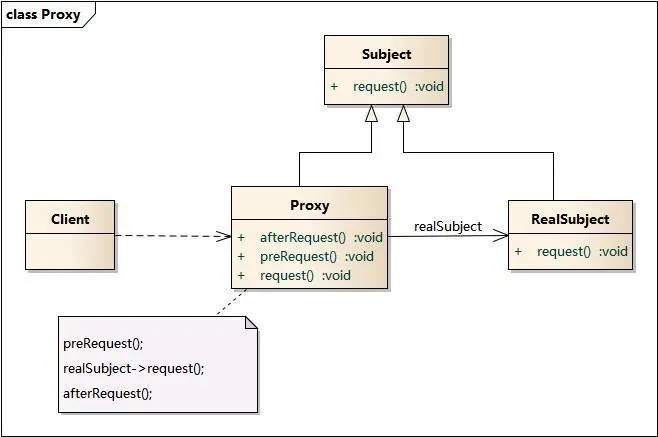

### 代理模式

要理解静态和动态这两个含义，我们首先需要理解一下 Java 程序的运行机制



首先 Java 源代码经过编译生成字节码，然后再由 JVM 经过类加载，连接，初始化成 Java 类型，可以看到字节码是关键，静态和动态的区别就在于字节码生成的时机。**静态代理**：由程序员创建代理类或特定工具自动生成源代码再对其编译。在编译时已经将接口，被代理类（委托类），代理类等确定下来，在**程序运行前**代理类的.class文件就已经存在了**动态代理**：在**程序运行后**通过反射创建生成字节码再由 JVM 加载而成


#### 静态代理



```java
public interface Subject {
   public void request();
}

public class RealSubject implements Subject {
   @Override
   public void request() {
       // 卖房
       System.out.println("卖房");
   }
}

public class Proxy implements Subject {

   private RealSubject realSubject;

   public Proxy(RealSubject subject) {
       this.realSubject = subject;
   }


   @Override
   public void request() {
    // 执行代理逻辑
       System.out.println("卖房前");

       // 执行目标对象方法
       realSubject.request();

       // 执行代理逻辑
       System.out.println("卖房后");
   }

   public static void main(String[] args) {
       // 被代理对象
       RealSubject subject = new RealSubject();

       // 代理
       Proxy proxy = new Proxy(subject);

       // 代理请求
       proxy.request();
   }
}
```

静态代理主要有两大劣势

1. 代理类只代理一个委托类（其实可以代理多个，但不符合单一职责原则），也就意味着如果要代理多个委托类，就要写多个代理（别忘了静态代理在编译前必须确定）
2. 第一点还不是致命的，再考虑这样一种场景：如果每个委托类的每个方法都要被织入同样的逻辑，比如说我要计算前文提到的每个委托类每个方法的耗时，就要在方法开始前，开始后分别织入计算时间的代码，那就算用代理类，它的方法也有无数这种重复的计算时间的代码

#### 动态代理

动态代理分为 JDK 提供的动态代理和 Spring AOP 用到的 CGLib 生成的代理


##### JDK提供的动态代理

```java
// 委托类
public class RealSubject implements Subject {
  @Override
  public void request() {
    // 卖房
    System.out.println("卖房");
  }
}


import java.lang.reflect.InvocationHandler;
import java.lang.reflect.Method;
import java.lang.reflect.Proxy;

public class ProxyFactory {

  private Object target;// 维护一个目标对象

  public ProxyFactory(Object target) {
    this.target = target;
  }

  // 为目标对象生成代理对象
  public Object getProxyInstance() {
    return Proxy.newProxyInstance(target.getClass().getClassLoader(), target.getClass().getInterfaces(),
        new InvocationHandler() {

​          @Override
​          public Object invoke(Object proxy, Method method, Object[] args) throws Throwable {
​            System.out.println("计算开始时间");
​            // 执行目标对象方法
​            method.invoke(target, args);
​            System.out.println("计算结束时间");
​            return null;
​          }
​        });
  }

  public static void main(String[] args) {
    RealSubject realSubject = new RealSubject();
    System.out.println(realSubject.getClass());
    Subject subject = (Subject) new ProxyFactory(realSubject).getProxyInstance();
    System.out.println(subject.getClass());
    subject.request();
  }
}

打印结果如下:shell
原始类:class com.example.demo.proxy.staticproxy.RealSubject
代理类:class com.sun.proxy.$Proxy0
计算开始时间
卖房
计算结束时间
```

我们注意到代理类的 class 为 **com.sun.proxy.$Proxy0**，它是如何生成的呢，注意到 Proxy 是在 java.lang.reflect 反射包下的，注意看看 Proxy 的 newProxyInstance 签名

```java
public static Object newProxyInstance(ClassLoader loader,
                                         Class<?>[] interfaces,
                                         InvocationHandler h);
```

1. **loader**: 代理类的ClassLoader，最终读取动态生成的字节码，并转成 java.lang.Class 类的一个实例（即类），通过此实例的 newInstance() 方法就可以创建出代理的对象
2. **interfaces**: 委托类实现的接口，JDK 动态代理要实现所有的委托类的接口
3. **InvocationHandler**: 委托对象所有接口方法调用都会转发到 InvocationHandler.invoke()，在 invoke() 方法里我们可以加入任何需要增强的逻辑 主要是根据委托类的接口等通过反射生成的

由于动态代理是程序运行后才生成的，哪个委托类需要被代理到，只要生成动态代理即可，避免了静态代理那样的硬编码，另外所有委托类实现接口的方法都会在 Proxy 的 InvocationHandler.invoke() 中执行，这样如果要统计所有方法执行时间这样相同的逻辑，可以统一在 InvocationHandler 里写， 也就避免了静态代理那样需要在所有的方法中插入同样代码的问题，代码的可维护性极大的提高了。JDK 动态

代理虽好，但也有弱点，我们注意到 newProxyInstance 的方法签名

注意第二个参数 Interfaces 是委托类的接口，是必传的， JDK 动态代理是通过与委托类实现同样的接口，然后在实现的接口方法里进行增强来实现的，这就意味着**如果要用 JDK 代理，委托类必须实现接口**，这样的实现方式看起来有点蠢，更好的方式是什么呢，直接继承自委托类不就行了，这样委托类的逻辑不需要做任何改动，CGlib 就是这么做的


[^JDK源码讲解]: https://www.jianshu.com/p/9bcac608c714


 ##### CGLib 动态代理

AOP 就是用的 CGLib 的形式来生成的，JDK 动态代理使用 Proxy 来创建代理类，增强逻辑写在 InvocationHandler.invoke() 里，CGlib 动态代理也提供了类似的  Enhance 类，增强逻辑写在 MethodInterceptor.intercept() 中，也就是说所有委托类的**非 final 方法**都会被方法拦截器拦截，在说它的原理之前首先来看看它怎么用的

```java
public class MyMethodInterceptor implements MethodInterceptor {
   @Override
   public Object intercept(Object obj, Method method, Object[] args, MethodProxy proxy) throws Throwable {
       System.out.println("目标类增强前！！！");
       //注意这里的方法调用，不是用反射哦！！！
       Object object = proxy.invokeSuper(obj, args);
       System.out.println("目标类增强后！！！");
       return object;
   }
}

public class CGlibProxy {
   public static void main(String[] args) {
       //创建Enhancer对象，类似于JDK动态代理的Proxy类，下一步就是设置几个参数
       Enhancer enhancer = new Enhancer();
       //设置目标类的字节码文件
       enhancer.setSuperclass(RealSubject.class);
       //设置回调函数
       enhancer.setCallback(new MyMethodInterceptor());

       //这里的creat方法就是正式创建代理类
       RealSubject proxyDog = (RealSubject) enhancer.create();
       //调用代理类的eat方法
       proxyDog.request();
   }
}

代理类:class com.example.demo.proxy.staticproxy.RealSubject$$EnhancerByCGLIB$$889898c5
目标类增强前！！！
卖房
目标类增强后！！！
```

可以看到主要就是利用 Enhancer 这个类来设置委托类与方法拦截器，这样委托类的所有**非 final 方法**就能被方法拦截器拦截，从而在拦截器里实现增强

底层实现原理:

它是通过**继承**自委托类，重写委托类的非 final 方法（final 方法不能重载），并在方法里调用委托类的方法来实现代码增强的，它的实现大概是这样

```java
public class RealSubject {
   @Override
   public void request() {
       // 卖房
       System.out.println("卖房");
   }
}

/** 生成的动态代理类（简化版）**/
public class RealSubject$$EnhancerByCGLIB$$889898c5 extends RealSubject {
   @Override
   public void request() {
       System.out.println("增强前");
       super.request();
       System.out.println("增强后");
   }
}
```

可以看到它并不要求委托类实现任何接口，而且 CGLIB 是高效的代码生成包，底层依靠 ASM（开源的 java 字节码编辑类库）操作字节码实现的，性能比 JDK 强，所以 Spring AOP 最终使用了 CGlib 来生成动态代理

**CGlib 动态代理使用限制**:只能代理委托类中任意的非 final 的方法，另外它是通过继承自委托类来生成代理的，所以如果委托类是 final 的，就无法被代理了（final 类不能被继承）


JDK 动态代理的拦截对象是通过反射的机制来调用被拦截方法的，CGlib 呢，它通过什么机制来提升了方法的调用效率?

由于反射的效率比较低，所以 CGlib 采用了FastClass 的机制来实现对被拦截方法的调用。FastClass 机制就是对一个类的方法建立索引，通过索引来直接调用相应的方法，参考**https://www.cnblogs.com/cruze/p/3865180.html**


##### 两种动态代理的不同点

如果要用 JDK 代理，委托类必须实现接口；CGLib通过继承委托类的方式代理委托类的方法。

 JDK 代理通过**反射**操作字节码生成代理类；CGLIB 底层依靠 ASM（开源的 java 字节码编辑类库）操作字节码，同时还使用了FastClass?


[^整体参考]: https://mp.weixin.qq.com/s/PX7A3pUqQHhxkO3zJBWSJg


### 1
