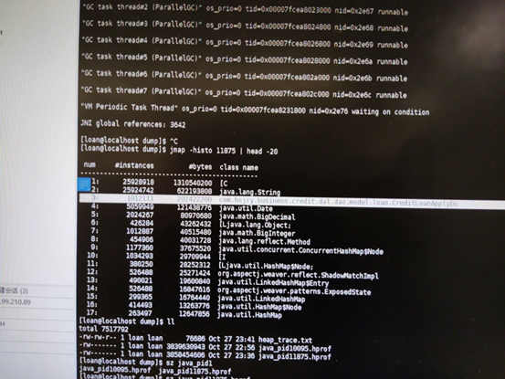
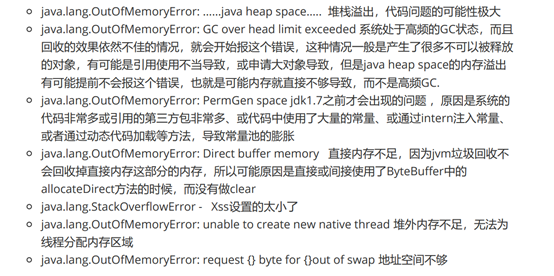
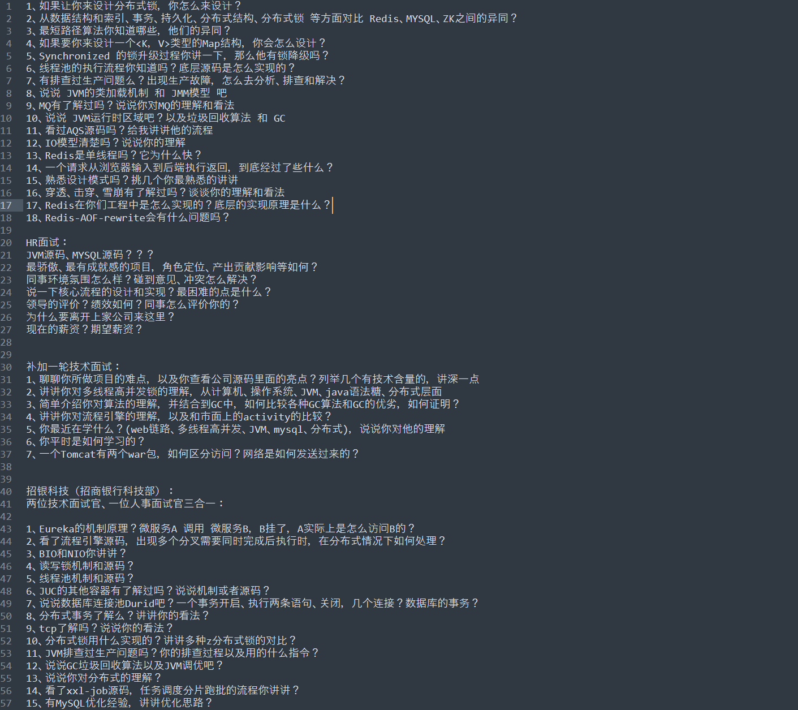
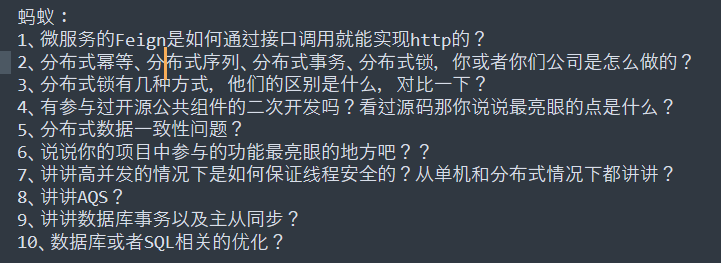
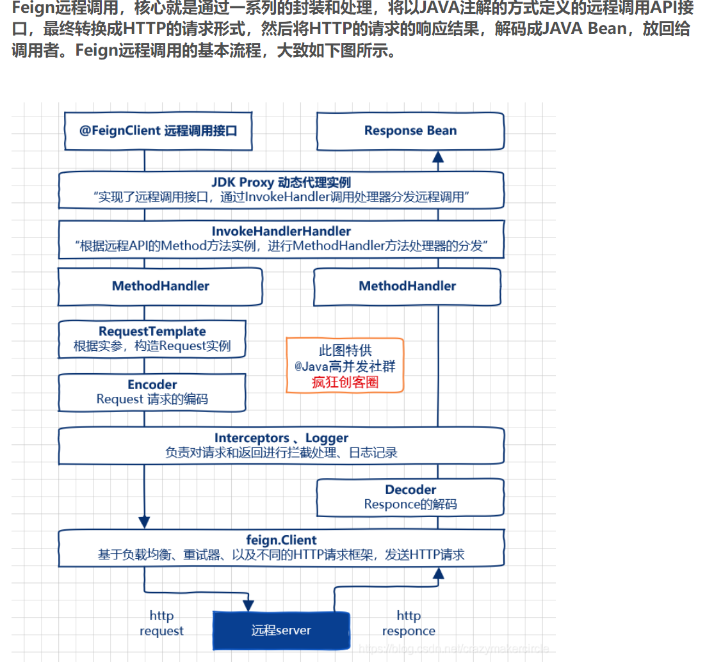

## 一、生产问题-jvm

1、 生产出现内存溢出，报错：java.lang.OutOfMemoryError:GC over head limit exceeded

2、 排查步骤

（1）、在压测环境复现问题，jvm添加参数 -XX:+HeapDumpOnOutOfMemoryError ，溢出时可以自动生成dump包

（2）、jps查出Java程序的进程号

（3）、jinfo 加进程号查看堆参数设置及溢出发生时dump包的存放位置

（4）、jmap查看占用内存前20的对象及其同一类型的数量

（5）、同时使用jdk提供的分析工具jvisualvm及日志找到报错的代码位置

（6）、分析代码

分片使用的字段和用来排序的字段不是同一字段，后续根据分片结果查询一片数据时

3、原因

​    在对数据库的记录进行分片时，先根据某一字段排序，并每隔一个固定大小取一个值，两个值组成一片，取数时通过比较该字段取数据库中大于等于这一片的开始值，小于这一片的结束值，获得一片的数据，比如有100条数据，10条为一片，以序号排序分片，则序号0-10，10-20就是一片（最后会额外加一片把剩下的都包括进去），但这次分片时没有对分片字段排序，导致取数时分片的开始与结束值范围远远大于一片的范围，从而内存溢出

## 二、面经

## 三、遗落的知识点

### 微服务

### 

### 1

